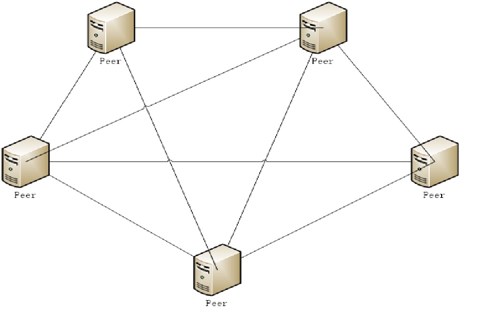

# 开放式社交公共网络整体架构

开放式社交公共网络的底层通讯采用了基于DHT结构的P2P技术。每一家接入的企业都将以一个节点的形式接入到OSPN中。

企业作为节点接入需要三个部分，connector，IM服务（IMS），客户端（APP，小程序，或者web）。

图片

connector的作用是与其他企业的connector进行数据交换。

我们以USER1发送消息给USER2为例
跨界通信 消息流程如下

USER1          IMS1            CONN1           边界      CONN2          IMS2         USER2
MSG      ->            找人->               找人->                    找人->   
                                  <-                              <-                    <-获取列表   
                              列表->                     ...                            ->             ->       
                                   <-                       ...                                            <-获取消息
                               消息->                    ...                                              -> 
                                    完成<-                    ...                                            <-回执
                                                                ....
                                       <-                       ...                                            <-获取消息
                                    消息->                    ...                                              -> 
                                    完成<-                    ...                                            <-回执

USER1首次给USER2发送消息时会将消息发送给IMS1，IMS1发送找人命令给CONN1，CONN1到OSPN网络里广播找人。消息发送给IMS时会在IMS逗留，企业可以根据自己的情况决定消息滞留时间，我们建议7天或者1个月比较合理。IMS发送找人命令我们建议是在一定时间内（建议10分钟，企业可根据自己的实际情况进行调整。）消息没有被取走才发送找人命令。为了保护用户隐私connector广播找人时是没有回应的。

CONN2收到广播找人消息以后会将命令发送给IMS2,IMS2判断USER2是否在自己的服务上。我们推荐以在线为准，如果user2在线，IMS2才会去获取用户源列表。

IMS1接收到获取用户列表命令以后发送关于某一用户的列表。

USER2收到列表以后根据自己的需求，筛选所需消息，发送获取消息命令。

IMS1接收到获取消息命令以后发送消息。

USER2接收到消息以后验证签名，并发送回执。

IMS1接收到回执，删除滞留的消息。

